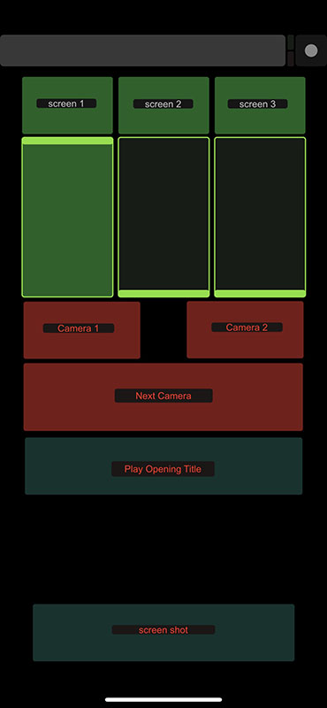

# VPStudio Open Sound Control (OSC) Controller Setup

Release 3 of VPStudio has some features that can be controlled by an OSC control surface.  I use [Hexler Touch OSC](https://hexler.net/products/touchosc) which is available for iPhone or Android.  Other OSC apps should work just as well if you set them up the same as I have.

# Sample OSC control Surface 

This is what the controller looks like in TouchOSC when it is running, at the top it has a button for each of 3 screens to make them move up and down.  Below those buttons is a volume control for each screen.  There is also a button to switch between cameras, to go to the next camera, to play an opening "flying logo" title and to take a screenshot.  The screen and camera buttons light up when that item is active and the volume controls will move as the volume changes.

The way the "flying screen" actor is setup, the volume will automatically fade down as the screen moves out of the way and fade back up again when you activate it.  You will see this change on the volume control sliders too.  If you tap one of the screen buttons while the screen is moving, it will stop and the next tap will send it in the opposite direction.

Please follow the documentation on the TouchOSC site for info on how to load my layout into your phone.

# List of OSC messages

There are many OSC control surface applications available besides TouchOSC.  There are mobile apps, PC apps and even dedicated hardware.  If you use something other than TouchOSC you will have to set it up to send the right messages, here is a list.  All these are buttons set to only send a message on "press".  The volume ones are faders/sliders/dials, anything that can display an analog value.

All the controls are set to send and receive a float value from 0 to 1.  The OSC app should be set to send single messages, not "bundles"

/1/screen1

/1/screen2

/1/screen3

/1/volume1

/1/volume2

/1/volume3

/1/camera1

/1/camera2

/1/nextcamera

/1/title

/1/screenshot

# OSC in VPStudio

In the VPPlayerController a blueprint sets up OSCClient and OSCServer.  There is a variable in the VPPlayerController called OSCClientAddress which should be set to the ip address of your OSC device.

Other actors like "flying screen" and "flying logo controller" get the osc client and server references from the player controller when they need them and use these to send and receive their own messages.

# Problems? Let me know!

Please let me know if you have problems using the OSC support and I'll try to help out.
